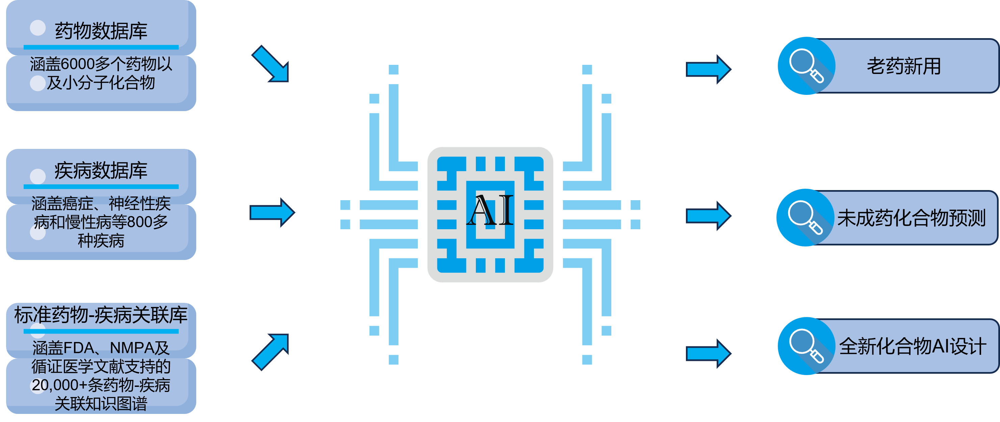
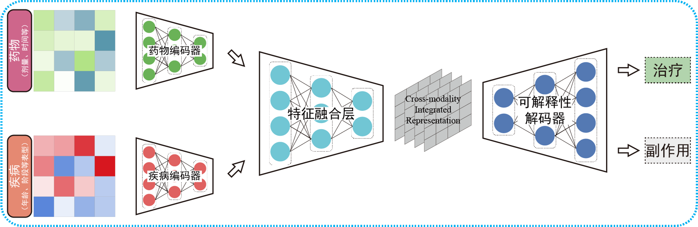
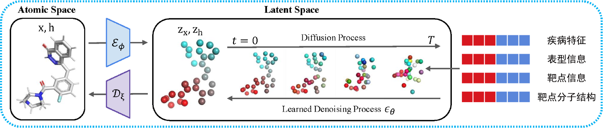
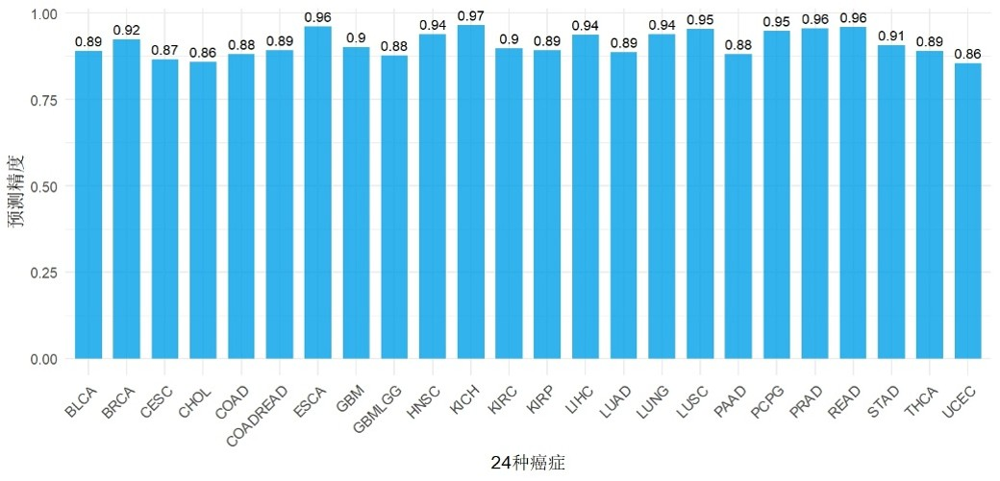

# AIDdrug
> 
An AI-Powered Platform for Investigating Disease-Drug Association.

 

## File Description:
Code: Data processing related code.

Data: Image data.

Database: Test data for the database (the original dataset is too large and stored on the local server).

Model: Code related to AI model training, testing, and inference.

## Main Features:

 
1. Encoder-Decoder Architecture-Based Drug-Disease Association Learning Model:
Designed for drug repurposing, candidate compound screening, and target prediction.

 
2. Multi-Condition-Guided Generative Drug Molecular Design & Optimization Model:
Enables: Drug molecular structure optimization, De novo drug molecule generation, Target molecular docking evaluation.

## Benchmark Results:

 
In predicting therapeutic drugs for 24 cancer types, our platform achieved prediction accuracy exceeding 85% across all cases.
